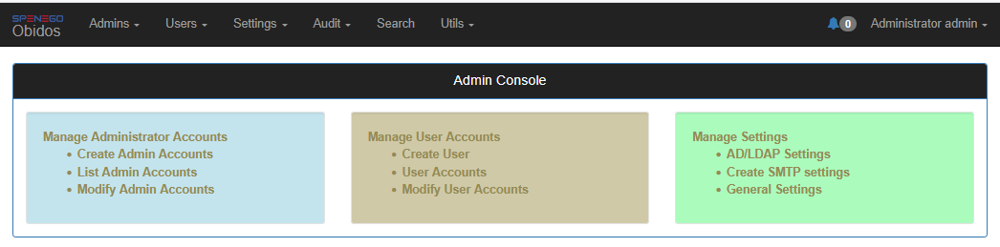
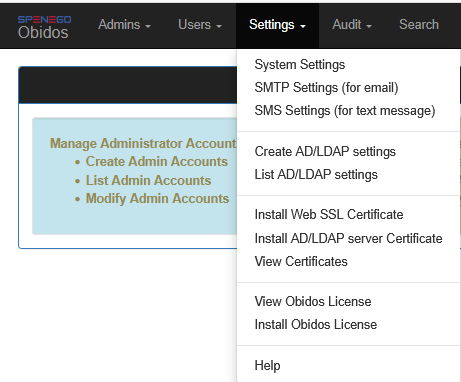
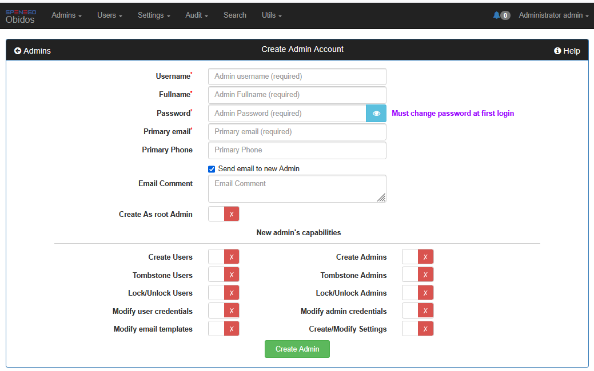
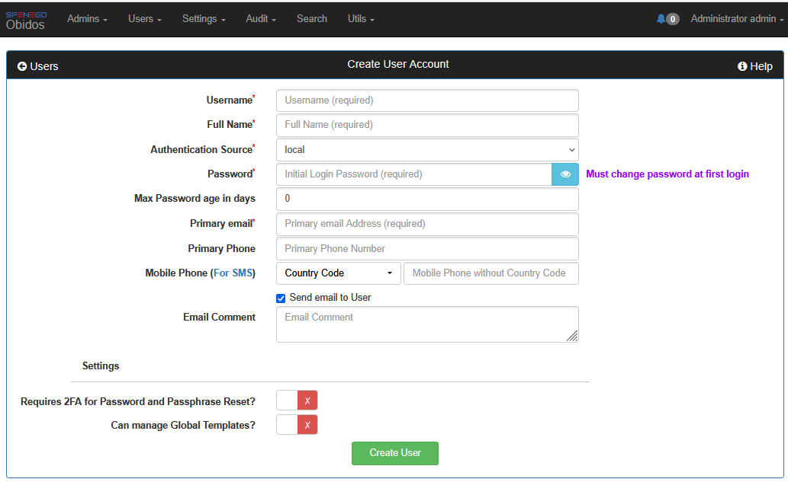
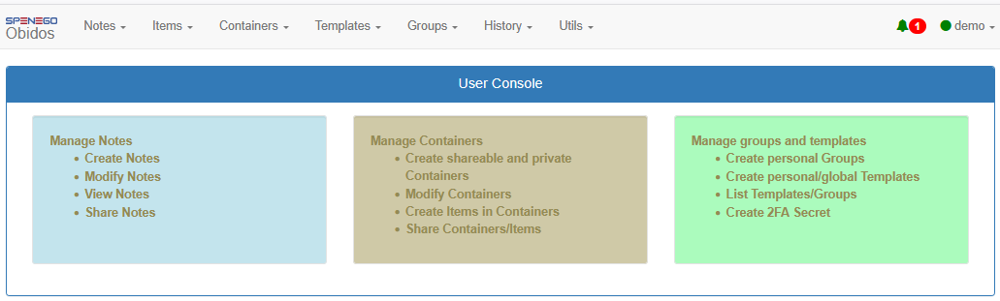
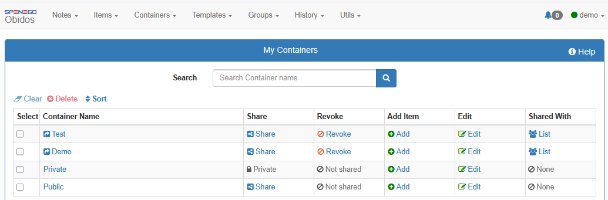
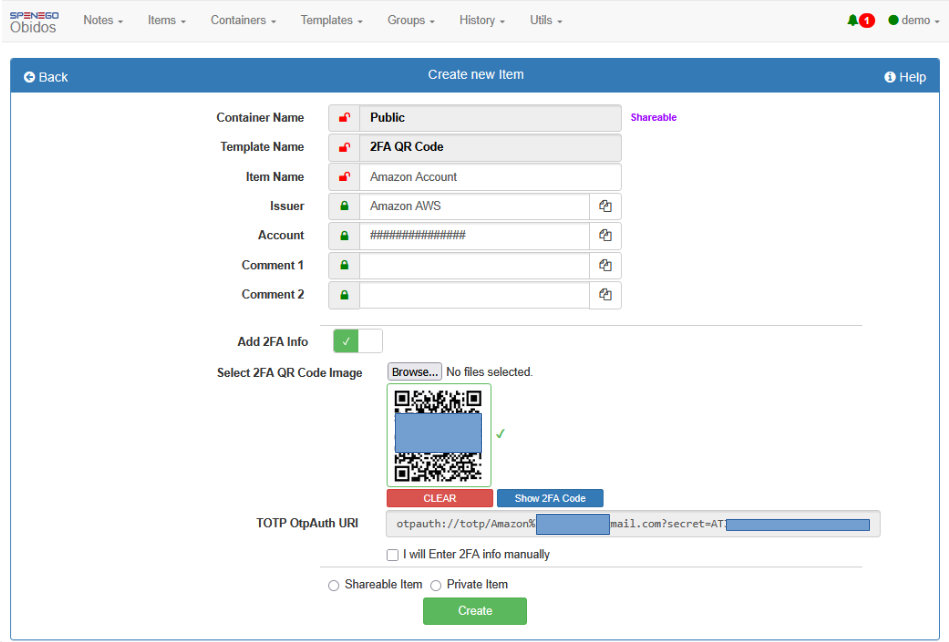
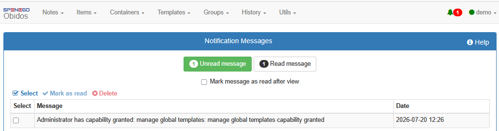
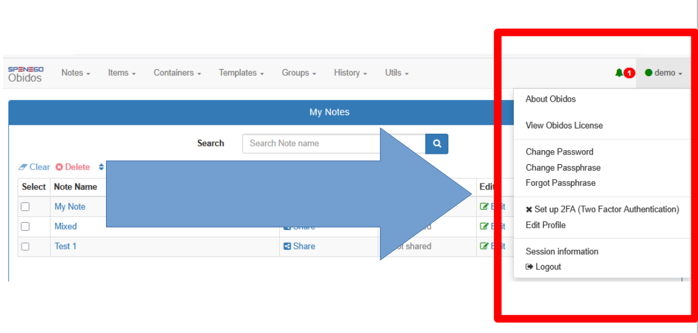
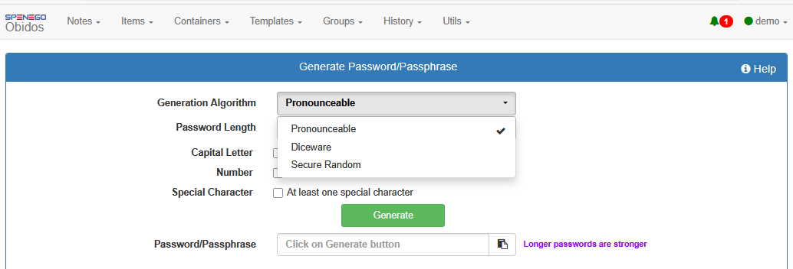

# Table Of Contents
- [Introduction](#introduction)
- [Features in Obidos](#features-in-obidos)
- [Try out Obidos](#try-out-obidos)
  - [Demo server](#demo-server)
  - [Install using docker (easiest)](#install-using-docker-easiest)
  - [Manually compile from source](#manually-compile-from-source)
- [Videos and guides about Obidos](#videos-and-guides-about-obidos)
  - [User Interface](#user-interface)
  - [Informational Videos](#informational-videos)
- [Screenshots](#screenshots)
  - [Admin Console](#admin-console)
  - [Obidos Settings](#obidos-settings)
  - [New Admin Creation Form](#new-admin-creation-form)
  - [New User Creation Form](#new-user-creation-form)
  - [User Console](#user-console)
  - [User Containers](#user-containers)
  - [Adding a QR Code 2FA Item](#adding-a-qr-code-2fa-item)
  - [User Messages](#user-messages)
  - [User level personalizations](#user-level-personalizations)
  - [Password Generator](#password-generator)
- [License (Dual-licensed)](#license-dual-licensed)
- [Enterprise vs OpenSource](#enterprise-vs-opensource)
- [Crypto libraries used](#crypto-libraries-used)
- [Installataion](#installataion)
  - [Install using Docker or Podman](#install-using-docker-or-podman)
  - [Manual Installation from source](#manual-installation-from-source)
    - [Compiling Obidos from source](#compiling-obidos-from-source)
    - [Installing runtime dependencies](#installing-runtime-dependencies)
    - [Setting up the database](#setting-up-the-database)
    - [Reclaiming ownership of the install directory](#reclaiming-ownership-of-the-install-directory)
    - [Installing Jetty and deploying the WAR](#installing-jetty-and-deploying-the-war)
      - [Generating a self-signed certificate](#generating-a-self-signed-certificate)
    - [Running Jetty as a systemd service](#running-jetty-as-a-systemd-service)
    - [Logging in](#logging-in)
    - [Changing the Jetty port](#changing-the-jetty-port)
- [GWT Super Dev Mode](#gwt-super-dev-mode)

</br>

# Introduction

[Obidos](https://github.com/spenego/Obidos) from [Spenego Software LLC](https://spenego.com) is a web-based self-hosted secure information repository for storing and sharing private or confidential information within organizations using fine-grained access control. 
Due to the digital nature of business operations, every organization will have many pieces of confidential or sensitive information that needs to be stored securely and shared only with the right individual (or group of individuals) within the organization.
These digital artifacts include login credentials, 2FA QR/Recovery codes, design documents, contracts, files (any type), contact information (attorneys, insurance contacts, vendors, ..), corporate credit cards, corporate subscription information etc. that span various departments (HR, Finance, Facilities, IT, Executive Office, etc.).
Using a templating model, both structured (or predefined) and arbitrary digital artifacts can be stored and shared in [Obidos](https://github.com/spenego/Obidos).

[Obidos](https://github.com/spenego/Obidos) platform gives individual users the power to share or revoke access to information. The individual owner has visibility as to who has access to what information. Administrator accounts have no access to information stored by individual users. Organization-wide AD(Active Directory)/LDAP can be integrated into [Obidos](https://github.com/spenego/Obidos) so that corporate IAM policies can be enforced.
 
[Obidos](https://github.com/spenego/Obidos) was marketed as a commerical product since 2024. 
[Obidos](https://github.com/spenego/Obidos) is built on IETF and defacto industry standards. There is nothing proprietary about [Obidos](https://github.com/spenego/Obidos). Also, [Obidos](https://github.com/spenego/Obidos) uses many Open Source libraries.
Since the developers of [Obidos](https://github.com/spenego/Obidos) are consumers and contributors of Open Source software, it is only natural that [Obidos](https://github.com/spenego/Obidos) itself be opened up to the community. Hence this effort.


</br>

# Features in Obidos

1. Easy to use dashboards for admins and users that works with any html5 compatible browsers.
1. Subordinate administrative accounts can be created for specific capabilities.
1. Multiple AD/LDAP's can be integrated in addition to local user accounts.
1. Existing SMTP server/gateway can be integrated for email functionality.
1. SMS gateway can be integrated for texting.
1. Email Templates are provided for customizing messages.
1. Auditing is built in.
1. 2FA QR Code can be set by users for preventing unauthorized password/passphrase resets.
1. Built-in credentials management capability. This includes password management and password generator. 
1. Built-in Authenticator (TOTP) app. So 2FA QR Codes can be stored and Authenticator codes can be viewed directly within Obidos.
1. Built-in notification messaging system. External notifications can be done via email and SMS.
1. A number of Global Templates are provided out of the box. These include popular formats such as Contact Information, Credit Card Info, Bank Details and 2FA QR Code. You can create additional Global Templates as well as Personal Templates to suite the structure of the artifact you want to store.
1. One off Items can be created using adhoc templating.
1. 'Notes' can be created for free format textual information.
1. Items are stored in Containers. Both Items and Containers can be tagged as Private or Shareable. Tagging as Private prevents from accidentally exposing information.
1. Items can be created with an expiration. This prevents the visibility of the Item after expiration date.
1. Update permissions on artifacts can be given to other users by owner of the artifact.
1. Ownership of an artifact can be transferred to another user.
1. Group sharing is available. When a new user is added to a group, all information previously shared with the group will be available to the new user. Similarly, when a user is removed from a group, all access that were set on the group will be revoked from that user.
1. Any type of file can be attached to an Item.

Note that Obidos is neither a File Server nor a Document Management System. However, file sharing is supported as part of sharing digital artifacts (such as a design document or support contract) that are critical in the context of business operations.


</br>

# Try out Obidos

## Demo server
* If you just want to get a feel for [Obidos](https://github.com/spenego/Obidos) User Interface, you can try [Obidos Demo Server](https://demo.spenego.com) using username 'hndemo' and password 'hndemo'. When prompted for Passphrase, click on "Ask Me Later". You will be able to navigate through the interface, but you will not be able to create anything using this account.
</br>

## Install using docker (easiest)
* To get a Quick Installation of [Obidos](https://github.com/spenego/Obidos) using docker or podman and try out all the features of Obidos, check the sister repo [https://github.com/spenego/Obidos-Docker.git](https://github.com/spenego/Obidos-Docker.git).
</br>

## Manually compile from source
* To manually compile [Obidos](https://github.com/spenego/Obidos) from source, please look at the secion [Manual Installation from source](#manual-installation-from-source)


</br>

# Videos and guides about Obidos

## User Interface

The following materials are helpful to understand the User Interface and usage of [Obidos](https://github.com/spenego/Obidos).

* [Introductory videos about using Obidos]( https://videos.spenego.com/user.html)
* [User Guide](https://spenego.com/user_guide.html)
* [Admin Guide](https://spenego.com/admin_guide.html)

## Informational Videos

To learn more about [Obidos](https://github.com/spenego/Obidos), check these videos:

* [State of the Art Secure Info Storing and Sharing using Obidos](https://www.youtube.com/watch?v=uENfbNsK2Cs)
* [Quick Overview of Obidos](https://www.youtube.com/watch?v=IzfsjoyJ4JI)
* [Blue Ocean Obidos](https://www.youtube.com/watch?v=k6HgU8lAfE8)


</br>

# Screenshots

## Admin Console



</br>

## Obidos Settings



</br>

## New Admin Creation Form



</br>

## New User Creation Form



</br>

## User Console



</br>

## User Containers



</br>

## Adding a QR Code 2FA Item



</br>

## User Messages



</br>

## User level personalizations



</br>

## Password Generator




</br>

# License (Dual-licensed)

[Obidos](https://github.com/spenego/Obidos) is dual-licensed under a commercial license and the GNU Affero
General Public License (AGPL) v3.0. Please look at the [LICENSE](LICENSE) for details.


For commercial licensing, please contact
[Spenego Software LLC](https://spenego.com) at [https://spenego.com/contacts.html](https://spenego.com/contacts.html)


</br>

# Enterprise vs OpenSource

Currently commercially supported enterprise version of [Obidos](https://github.com/spenego/Obidos) and the
OpenSource version have the exact same features.

The commercial versions come with some extras in addition to [Obidos](https://github.com/spenego/Obidos) software. These include administrative scripts (back up database, upgrade Obidos, bulk import users, etc.), web console (cockpit), SNMP support, professional installation, training and professional support.


</br>

# Crypto libraries used

* [libsodium-jna](https://github.com/muquit/libsodium-jna) - Thin Java wrapper around [libsodium](https://github.com/jedisct1/libsodium)


</br>

# Installataion
## Install using Docker or Podman

* The easiest way to try out [Obidos](https://github.com/spenego/Obidos) is to install it using [Docker](https://docker.io/) or [Podman](https://podman.io/)
* Please check out the sister repo [https://github.com/spenego/Obidos-Docker.git](https://github.com/spenego/Obidos-Docker.git) for details on how to
install using [Docker](https://docker.io/) or [Podman](https://podman.io/)

## Manual Installation from source

**Note: manuall installation process is quite involved. Support and installer
is available under commercial license. Please contact [Spenego Software LLC](https://spenego.com) at [https://spenego.com/contacts.html](https://spenego.com/contacts.html) for
details.**

This guide walks through building [Obidos](https://github.com/spenego/Obidos) from source and running it on a
single Ubuntu 24.04 machine. No nginx, no dedicated service user, just Jetty
terminating TLS directly with a self-signed certificate. It's meant for
developers and evaluators who want a running [Obidos](https://github.com/spenego/Obidos) with the least ceremony
possible.

**Note:** This is not the production setup. Commercial customers get the
packaged installer (TLS via nginx, hardened service accounts, Cockpit, cron
watchdogs, etc). None of that is covered here.

Tested against:

* Ubuntu 24.04 server
* OpenJDK 17
* MariaDB 11.4
* Jetty 9.4.56

All commands assume you're logged in as a regular user with `sudo` access,
unless a step says otherwise.

**TLS is required**. The GWT client code
reads/writes the system clipboard (`navigator.clipboard`) for copying
secrets, and browsers only expose that API in a secure context: HTTPS.
During logout, [Obidos](https://github.com/spenego/Obidos) clears system clipboard and if transport is not
HTTPS, a JavaScript exception is thrown and logout from the app fails.

A self-signed cert is enough to satisfy the browser's secure context check,
it does not need to be CA-signed for this guide.

### Compiling Obidos from source

```bash
sudo apt update
# Install jdk 17 first, otherwise maven will pull a different version of java
sudo apt install -y git openjdk-17-jdk
sudo apt install -y maven

git clone https://github.com/spenego/Obidos.git
cd Obidos

# Remember where the repo lives, later steps cd elsewhere (jetty_base,
# scripts/) and need to refer back to it
export OBIDOS_SRC="$PWD"

# Must set JAVA_HOME 
export JAVA_HOME=$(readlink -f /usr/bin/javac | sed "s:/bin/javac::")

./compile.sh prod
```

This produces `target/Obidos-<version>.war`. This is the file we'll deploy
as `ROOT.war` further down in [Installing Jetty and deploying the WAR](#installing-jetty-and-deploying-the-war).

### Installing runtime dependencies

[Obidos](https://github.com/spenego/Obidos) uses libsodium (via JNI/libsodium-jna) for its crypto. At
initialization, [Obidos](https://github.com/spenego/Obidos) registers `/usr/local/spenego/lib/` with
libsodium-jna as the only place to look for the native library. This is
intentional, not a fallback, so it doesn't matter that apt's own copy is
elsewhere and registered with `ldconfig`. libsodium-jna never searches the
standard system library paths here, the `.so` file has to actually exist at
that exact path.

```bash
sudo apt install -y libsodium-dev unzip

sudo mkdir -p /usr/local/spenego/lib
sudo cp /usr/lib/x86_64-linux-gnu/libsodium.so /usr/local/spenego/lib/libsodium.so
```

(`libsodium-dev` is what provides that unversioned `libsodium.so` symlink,
`libsodium23`, which actually holds the code, comes along as its
dependency.)

### Setting up the database

```bash
cd "$OBIDOS_SRC/scripts"
sudo ./install-mariadb
```

What this does:

* Creates `/usr/local/spenego/obidos`, then `chown`s all of
  `/usr/local/spenego` to `nobody` with `go+rx` permissions.
* Runs `./GenObidosJdbc_linux` (no arguments). This writes the encrypted
  connection file to `/usr/local/spenego/obidos/jdbc.xml` (a path
  hardcoded inside the binary, not something you can relocate) and prints
  the generated (random) password and connection details to stdout in the
  form `hostname:...|port:...|dbname:...|username:...|password:...`.
* Installs `mariadb-server` via `apt`, enables and starts the service.
* Grants privileges to the generated DB user (`obidos`/`obidos`) and loads
  `init_db.sql` + `local.sql` as `root` (MariaDB's default unix_socket auth
  lets `root` connect passwordlessly when run as root).

You don't need to write down the password it prints. The app reads it back
out of `jdbc.xml` at runtime. If you ever need to see it again later, e.g.
to poke the database by hand with the `mariadb` CLI, run
`./scripts/DecryptObidosJdbc_linux`, which decrypts the existing `jdbc.xml`
without generating a new password.

**Default login after setup:** username `admin`, password `admin`, with a
forced password change on first login (this comes from `local.sql`).

**Note:** `local.sql` sets `system_config.server_port = 443` and
`fqdn = "localhost"`. This guide serves HTTPS on `8443` instead (see
[Installing Jetty and deploying the WAR](#installing-jetty-and-deploying-the-war)),
so any feature that builds an absolute URL (e.g. password reset emails)
will reference the wrong port until you update the **Https Port** field
under **Settings > System Settings** after logging in. Update `fqdn` too
if you're accessing the server by IP or a real hostname rather than
`localhost`.

### Reclaiming ownership of the install directory

`install-mariadb` deliberately locks `/usr/local/spenego` down to `nobody`
after generating `jdbc.xml`, so nothing else needs write access to it by
default. For this dev setup, Jetty will run as your own user, so reclaim it:

```bash
sudo chown -R "$USER":"$USER" /usr/local/spenego
```

### Installing Jetty and deploying the WAR

```bash
export JETTY_HOME=/usr/local/spenego/jetty_home
export JETTY_BASE=/usr/local/spenego/obidos/jetty_base

mkdir -p "$JETTY_HOME"
tar -xzf "$OBIDOS_SRC/dist/obidos/jetty_dist.tar.gz" -C "$JETTY_HOME" --strip-components=1

mkdir -p "$JETTY_BASE"
cd "$JETTY_BASE"
# start.d/ must exist *before* --add-to-start runs, otherwise Jetty falls
# back to writing everything into one monolithic start.ini instead of
# per-module files in start.d/, and start.d/ never gets created at all
mkdir -p "$JETTY_BASE/start.d"
java -jar "$JETTY_HOME/start.jar" --add-to-start=ssl,https,deploy,jsp,ext,resources,console-capture
```

That last command is Jetty's own bootstrap mechanism. It creates
`webapps/`, `lib/ext/`, `logs/`, `etc/`, and the `start.d/*.ini` files for
the modules you asked for: TLS connector, WAR auto-deploy, JSP support, an
extra jars directory, and console log capture. No plain HTTP module is
enabled, see the TLS note in the [Install](#install) section for why.

#### Generating a self-signed certificate

Find the machine's IP address, this is what you'll put in the certificate
and later type into the browser's address bar:

```bash
ip a
```

Look for the `inet` line under your active network interface (e.g. `eth0`
or `enp0s3`), not `lo` (the loopback interface, `127.0.0.1`). For example,
`inet 192.168.1.213/24 ...` means your IP address is `192.168.1.213`.

The `--add-to-start=ssl` step above already copied Jetty's own demo
keystore to `$JETTY_BASE/etc/keystore`. Remove it first, otherwise
`keytool` will try to open it with the demo keystore's own password
instead of creating a fresh one, and fail with "Keystore was tampered
with, or password was incorrect":

```bash
rm -f "$JETTY_BASE/etc/keystore"
```

```bash
keytool -genkeypair -alias jetty -keyalg RSA -keysize 2048 -validity 3650 \
  -storetype PKCS12 -storepass changeit -keypass changeit \
  -keystore "$JETTY_BASE/etc/keystore" \
  -dname "CN=<IP-address>, OU=Obidos Eval, O=Obidos, L=NA, ST=NA, C=US"
```

Replace `<IP-address>` with the IP address you found above. Browsers will
still show a "connection is not private" warning for a self-signed cert,
that's expected, click through it (e.g. Advanced, then Proceed).

Point Jetty's SSL module at this keystore and bind it for remote access, the
module's default only binds `127.0.0.1`:

```bash
cat > "$JETTY_BASE/start.d/99-obidos-ssl.ini" <<'EOF'
jetty.ssl.host=0.0.0.0
jetty.ssl.port=8443
jetty.sslContext.keyStorePassword=changeit
jetty.sslContext.keyManagerPassword=changeit
EOF
```

Now add the JVM flags [Obidos](https://github.com/spenego/Obidos) needs, and deploy the WAR:

```bash
cat > "$JETTY_BASE/start.d/99-obidos.ini" <<'EOF'
--exec
--add-opens=java.base/java.lang=ALL-UNNAMED
--add-opens=java.base/java.lang.reflect=ALL-UNNAMED
EOF
```

**Note:** Jetty's `start.jar` forks a *child* JVM to actually run the
server. If you pass `--add-opens` on the command line instead, the child
JVM never sees it. These flags only take effect when they come from a
`start.ini`/`start.d` file combined with `--exec`, which tells Jetty to
build the child JVM's command line to include them.

```bash
cp "$OBIDOS_SRC"/target/Obidos-*.war "$JETTY_BASE/webapps/ROOT.war"
cp "$OBIDOS_SRC/dist/obidos/lib/javax.servlet-api-3.1.0.jar" "$JETTY_BASE/lib/ext/"

mkdir -p /usr/local/spenego/obidos/DataStore
```

Notice, `scripts/fix_war.bash` is not needed here. It patches the WAR's
cookie domain to work around a double-cookie bug that only happens when
both Jetty and a reverse proxy (nginx) set cookies. Since this guide talks
to Jetty directly with no proxy in front, skip it, only run it if you later
put this behind nginx.

**Note:** If Jetty fails to start or logging looks broken, the production
`jetty_base` bundles a specific `log4j` + `slf4j-log4j12` binding
(`lib/log4j/log4j-1.2.17.jar`, `lib/slf4j/slf4j-log4j12-1.7.25.jar`) instead
of Jetty's default logging module. If you hit `NoClassDefFoundError`
related to log4j/slf4j, copy those two jars into `$JETTY_BASE/lib/ext/` too.

### Running Jetty as a systemd service

```bash
sudo tee /etc/systemd/system/obidos.service > /dev/null <<EOF
[Unit]
Description=Obidos (Jetty)
After=network.target mariadb.service
Requires=mariadb.service

[Service]
Type=simple
User=$USER
Environment=JETTY_HOME=/usr/local/spenego/jetty_home
Environment=JETTY_BASE=/usr/local/spenego/obidos/jetty_base
WorkingDirectory=/usr/local/spenego/obidos/jetty_base
ExecStart=/usr/bin/java -jar \${JETTY_HOME}/start.jar
Restart=on-failure

[Install]
WantedBy=multi-user.target
EOF
```

* Start the service

```
sudo sed -i 's/sslMode=trust/sslMode=disable/g' /usr/local/spenego/obidos/jdbc.xml
sudo systemctl daemon-reload
sudo systemctl enable --now obidos
```

* Check status

```
$ systemctl --no-pager status obidos
obidos.service - Obidos (Jetty)
     Loaded: loaded (/etc/systemd/system/obidos.service; enabled; preset: enabled)
     Active: active (running) since Tue 2026-07-14 14:50:58 EDT; 22h ago
   Main PID: 447478 (java)
      Tasks: 77 (limit: 18510)
     Memory: 562.8M (peak: 615.8M)
        CPU: 6min 39.945s
     CGroup: /system.slice/obidos.service
             ├─447478 /usr/bin/java -jar /usr/local/spenego/jetty_home/start.jar
             └─447499 /usr/lib/jvm/java-17-openjdk-amd64/bin/java -Djava.io.tmpdir=/tmp -Djetty.home=/usr/local/spenego/jetty_home -Djetty.base=/usr/local/spenego/obidos/jetty_base --add-opens=java.base/java.lang=ALL-UNNAMED
--add-opens=java.base/java.lang.reflect=ALL-UNNAMED -cp /usr/local/spenego/jetty_home/lib/mail/javax.mail.glassfish-1.4.1.v201005082020.jar:/usr/local/spenego/obidos/jetty_base/lib/ext/javax.servlet-api-3.1.0.jar:/usr/local/spenego/obidos/jetty_base/resources:/usr/local/spenego/jetty_home/lib/servlet-api-3.1.jar:/usr/local/spenego/jetty_home/lib/jetty-schemas-3.1.jar:/usr/local/spenego/jetty_home/lib/jetty-http-9.4.46.v20220331.jar:/usr/local/spenego/jetty_home/lib/jetty-server-9.4.46.v20220331.jar:/usr/local/spenego/jetty_home/lib/jetty-xml-9.4.46.v20220331.jar:/usr/local/spenego/jetty_home/lib/jetty-util-9.4.46.v20220331.jar:/usr/local/spenego/jetty_home/lib/jetty-io-9.4.46.v20220331.jar:/usr/local/spenego/jetty_home/lib/jetty-jndi-9.4.46.v20220331.jar:/usr/local/spenego/jetty_home/lib/jetty-security-9.4.46.v20220331.jar:/usr/local/spenego/jetty_home/lib/transactions/javax.transaction-api-1.3.jar:/usr/local/spenego/jetty_home/lib/jetty-servlet-9.4.46.v20220331.jar:/usr/local/spenego/jetty_home/lib/jetty-webapp-9.4.46.v20220331.jar:/usr/local/spenego/jetty_home/lib/jetty-plus-9.4.46.v20220331.jar:/usr/local/spenego/jetty_home/lib/jetty-annotations-9.4.46.v20220331.jar:/usr/local/spenego/jetty_home/lib/annotations/asm-9.2.jar:/usr/local/spenego/jetty_home/lib/annotations/asm-analysis-9.2.jar:/usr/local/spenego/jetty_home/lib/annotations/asm-commons-9.2.jar:/usr/local/spenego/jetty_home/lib/annotations/asm-tree-9.2.jar:/usr/local/spenego/jetty_home/lib/annotations/javax.annotation-api-1.3.2.jar:/usr/local/spenego/jetty_home/lib/apache-jsp/org.eclipse.jdt.ecj-3.19.0.jar:/usr/local/spenego/jetty_home/lib/apache-jsp/org.eclipse.jetty.apache-jsp-9.4.46.v20220331.jar:/usr/local/spenego/jetty_home/lib/apache-jsp/org.mortbay.jasper.apache-el-8.5.70.jar:/usr/local/spenego/jetty_home/lib/apache-jsp/org.mortbay.jasper.apache-jsp-8.5.70.jar:/usr/local/spenego/jetty_home/lib/jetty-deploy-9.4.46.v20220331.jar org.eclipse.jetty.xml.XmlConfiguration /tmp/start_12468102937353830621.properties /usr/local/spenego/jetty_home/etc/jetty-bytebufferpool.xml /usr/local/spenego/jetty_home/etc/jetty-threadpool.xml /usr/local/spenego/jetty_home/etc/jetty.xml /usr/local/spenego/jetty_home/etc/jetty-webapp.xml /usr/local/spenego/jetty_home/etc/jetty-plus.xml /usr/local/spenego/jetty_home/etc/jetty-annotations.xml /usr/local/spenego/jetty_home/etc/console-capture.xml /usr/local/spenego/jetty_home/etc/jetty-deploy.xml /usr/local/spenego/jetty_home/etc/jetty-ssl.xml /usr/local/spenego/jetty_home/etc/jetty-ssl-context.xml /usr/local/spenego/jetty_home/etc/jetty-https.xml

Jul 14 14:50:58 test systemd[1]: Started obidos.service - Obidos (Jetty).
Jul 14 14:50:59 test java[447478]: 2026-07-14 14:50:59.366:INFO::main: Logging initialized @86ms to org.eclipse.jetty.util.log.StdErrLog
Jul 14 14:50:59 test java[447478]: 2026-07-14 14:50:59.556:INFO::main: Console stderr/stdout captured to /usr/local/spenego/obidos/jetty_base/logs/2026_07_14.jetty.log
```        


Check logs with `journalctl -u obidos -f` or under `$JETTY_BASE/logs/`.

### Logging in

Point a browser at:

```
https://<IP-address>:8443/
```

Use the same IP address you put in the certificate's `CN` earlier. Accept the
self-signed certificate warning, then:

* Username: `admin`
* Password: `admin`
* You'll be forced to set a new password on first login.

For an actual production deployment (CA-signed cert via nginx, hardened
service account, Cockpit, cron watchdogs, etc), use the commercial installer
instead of extending this guide.

### Changing the Jetty port

To serve on a port other than `8443`, edit `jetty.ssl.port` in
`$JETTY_BASE/start.d/99-obidos-ssl.ini` (created in
[Generating a self-signed certificate](#generating-a-self-signed-certificate)):

```bash
sudo sed -i 's/jetty.ssl.port=8443/jetty.ssl.port=<new-port>/' "$JETTY_BASE/start.d/99-obidos-ssl.ini"
sudo systemctl restart obidos
```

`local.sql` also set `system_config.server_port = 443`, which this guide
already overrides to `8443` (see the note in
[Setting up the database](#setting-up-the-database)). Update the **Https
Port** field under **Settings > System Settings** to match your new port,
otherwise features that build absolute URLs (e.g. password reset emails)
will reference the wrong port.


</br>

# GWT Super Dev Mode

[Obidos](https://github.com/spenego/Obidos) uses [GWT](https://www.gwtproject.org/) for frontend. The app can be debugged using
[Super Dev Mode](https://www.gwtproject.org/articles/superdevmode.html). Requires [tmux](https://github.com/tmux/tmux).

Look at [HOW_TO_COMPILE.txt](HOW_TO_COMPILE.txt) for details.


---
<sub>TOC is created by https://github.com/muquit/markdown-toc-go on Aug-02-2026</sub>
